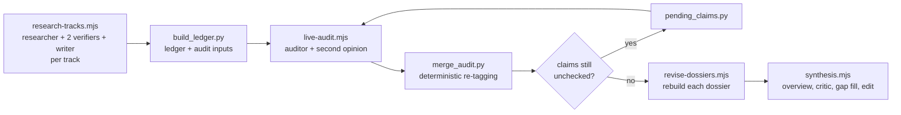

# The research team

The Interspecies Communication Research Program is run by a team of AI agents defined in this folder as Claude Code Workflow scripts. Every role, prompt, verification rule and tagging rule is in these files, so any run can be repeated, extended with new tracks, or re-audited.

## Roster

| Role | Per track | What it does | Web | Defined in |
|---|---|---|---|---|
| Track researcher | 1 | Searches the literature for its track and extracts 15-30 falsifiable claims. Each claim carries its source, evidence type (recorded activity, causal manipulation, wiring only, model prediction, ...) and a confidence rating. Also proposes projects and open questions. | Search, capped | `research-tracks.mjs` |
| Source-fidelity verifier | 1 | Checks that each cited work exists, says what the claim says, and is cited correctly. | Search, capped | `research-tracks.mjs` |
| Adversarial skeptic | 1 | Tries to refute or narrow each claim: wiring passed off as activity, sex or species mix-ups, single-lab results stated as settled, "translation" hype, superseded findings. | Search, capped | `research-tracks.mjs` |
| Dossier writer | 1 | Writes the track dossier from the adjudicated claims only. | None | `research-tracks.mjs` |
| Live auditor | 1 per round | Re-checks claims against live search results, confirming or correcting each one, and flags anything contradicted. | Search, capped | `live-audit.mjs` |
| Second-opinion checker | when needed | Independently re-checks any claim an auditor found contradicted. A claim is dropped only if both agree. | Search, capped | `live-audit.mjs` |
| Revision writer | 1 | Rebuilds the dossier from the audited ledger: updated tags, corrected citations, verified URLs, a verification appendix. | None | `revise-dossiers.mjs` |
| Program lead | 1 for the program | Synthesizes all dossiers into the program overview and ranked research agenda. | None | `synthesis.mjs` |
| Consistency checker | 1 | Finds cross-dossier conflicts (citations, numbers, names, tags). | Search, capped | `synthesis.mjs` |
| Completeness critic | 1 | Finds gaps and overclaims in the overview. | None | `synthesis.mjs` |
| Gap-fill researcher and skeptic | 1 pair per gap | Researches each gap with live search; the skeptic reviews the result before it is used. | Search, capped | `synthesis.mjs` |
| Editors | 2 | Fold gap findings into the overview and a gap addendum, and fix cross-dossier inconsistencies. | None | `synthesis.mjs` |

Claim adjudication and tagging happen in code (`research-tracks.mjs` for round 1, `merge_audit.py` for the audit rounds), not in a model's judgment.

## Pipeline

## Confidence tags

| Tag | Meaning |
|---|---|
| **[HIGH]** | The finding was visible in live search results, or both round-1 verifiers confirmed it and its source came from a live search. |
| **[MED]** | The source is confirmed but the specific finding was not directly visible; or the claim was corrected; or only one verifier confirmed it. |
| **[LOW]** | The source could not be located, or the claim is unconfirmed. |
| **[CONFLICT]** | Independent checks disagree. Both readings are shown. |

Every claim also carries an evidence type. In this program the most important distinction is between neurons **recorded** lighting up (calcium or voltage imaging, electrophysiology), neurons **manipulated** to test cause (optogenetics, silencing), and neurons that are only **wired** a certain way in a connectome.

## Running it

Run each step with the Claude Code Workflow tool. Pass `args` as a JSON object, not a string, and use absolute paths for `outDir`, `auditDir` and `payloadDir`.

1. **Research.** Run in batches of at most 5 tracks; see *Search budget* below.
   `Workflow({scriptPath: "Research/AnimalCommunication/team/research-tracks.mjs", args: {tracks: ["song-production", "song-perception"], outDir: "<abs>/Research/AnimalCommunication/tracks", today: "YYYY-MM-DD"}})`
2. **Ledger.** `python3 build_ledger.py WORK_DIR <workflow output files...> [--memory-only NN,NN]`
3. **Live audit.**
   `Workflow({scriptPath: ".../live-audit.mjs", args: {tracks: ["01", "02"], auditDir: "WORK_DIR/audit", budgets: {"01": 14, "02": 14}}})`
4. **Merge.** `python3 merge_audit.py WORK_DIR/ledger.json WORK_DIR/payload <audit output files...>`
5. **Repeat for leftovers (optional).** `python3 pending_claims.py WORK_DIR/payload WORK_DIR/audit WORK_DIR/audit-next`, then repeat step 3 on `audit-next` and step 4 with all audit outputs, earlier rounds first.
6. **Revise.** `Workflow({scriptPath: ".../revise-dossiers.mjs", args: {tracks: [{num, slug, title, memoryOnly}], payloadDir, outDir, today}})`
7. **Synthesize.** `Workflow({scriptPath: ".../synthesis.mjs", args: {root: "<abs>/Research/AnimalCommunication", today, tracks: [{num, slug, title}]}})`

To add a research track, add an entry to `TRACKS` in `research-tracks.mjs` with `key`, `num`, `slug`, `title` and a `brief`. The brief should give the scope, seed leads (labelled as unverified) and the track's deliverable.

## Search budget and other constraints (observed 2026-09-25)

- **Web search is capped per session.** The cap was 200 searches in a rolling window that the run's timeline puts between 40 and 54 minutes. All agents share it. In run 1, six researchers with open-ended search instructions spent all 200 in ten minutes. Three researchers and every verifier then worked from model memory. That is why each script now gives every agent a hard search budget and tells it to stop and report unchecked items when the cap is hit. At the default budgets, research + 2 verifiers is 30 searches per track, so keep a batch to 5-6 tracks per window.
- **Page fetches may be blocked.** The environment's egress policy blocked WebFetch for nature.com, ncbi.nlm.nih.gov, pubmed, biorxiv.org, arxiv.org, janelia.org, europepmc.org and api.crossref.org. All checks therefore rely on search-result text. Allowing those domains in the environment's network settings would let auditors read abstracts directly.
- **Concurrency.** Each workflow runs at most min(16, CPUs - 2) agents at once, which was 2 on the 4-CPU container. Run 1 split the nine tracks across three workflows running in parallel.
- **URLs.** Agents may cite only URLs that appeared in their own search results. Dossiers write "URL not verified" rather than print a URL no search returned.
